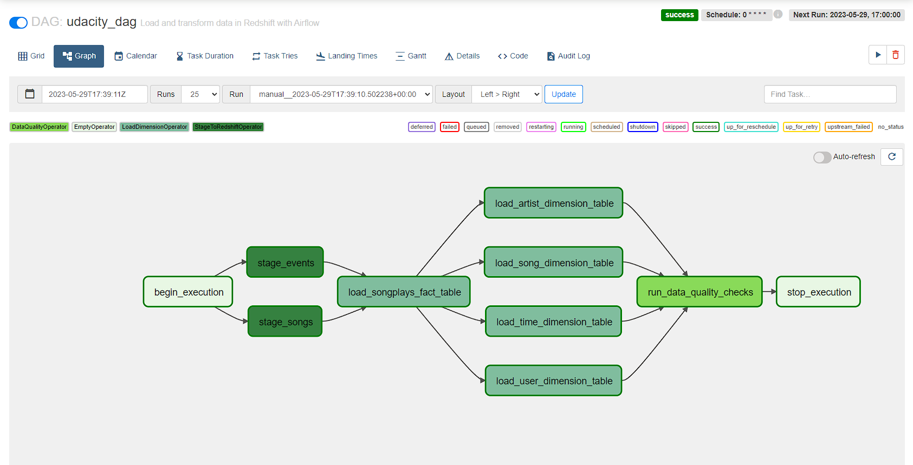
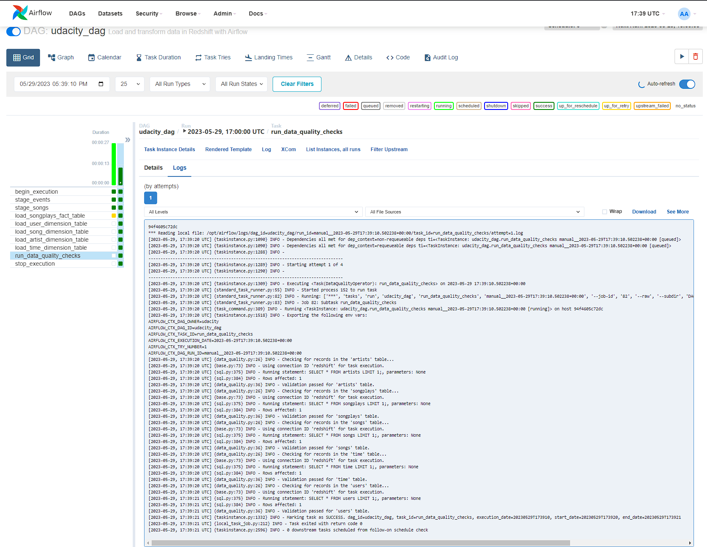

# Data Pipelines: Project

## Submission Information

Author: Timothy Ricks

Submission Date: 2023-05-29

External Repository: [GitHub](https://github.com/rickstc/udacity-data-engineering)

---

## Project Abstract

The project narrative states that the student has been tasked with assisting Sparkify, a music streaming startup, in building an ETL pipeline leveraging Amazon's Redshift and Apache Airflow. This pipeline needs to rely on Apache Airflow operators to extract song and log data from JSON files stored in S3, process them using a data warehouse in AWS's Redshift, load the data into dimensional tables, and run some basic data quality checks to ensure that the pipeline ran correctly.

---

### ...

## Documentation

### Files

The following is a list of files contained in the repository:
| File             | Description                                                                                                                                                                                                                                                                                                                                                                          |
| ---------------- | ------------------------------------------------------------------------------------------------------------------------------------------------------------------------------------------------------------------------------------------------------------------------------------------------------------------------------------------------------------------------------------ |
| assets/*   | Directory for images that are linked to in this document.  |
| dags/submission_dag.py   | The student's DAG definition which describes the Airflow Pipeline |
| plugins/helpers/sql_queries.py  | File provided by Udacity which contains the SQL queries necessary to load the data into tables |
| operators/data_quality.py   | The Data Quality Operator the student is using to ensure that the data was sucessfully loaded into the dimension tables |
| operators/load_dimension.py   | The Operator the student is using to load data into dimension tables |
| operators/load_fact.py   | The Operator the student is using to load data into fact tables |
| operators/stage_redshift.py   | The Operator the student is using to load data into the staging tables from S3 |

## Project Status

### DAG Graph View
Here is a graph view of the DAG that the student created, illustrating the correct dependencies.

### DAG Logs
Here is the log output of the data quality operator, illustrating successful data validation.
