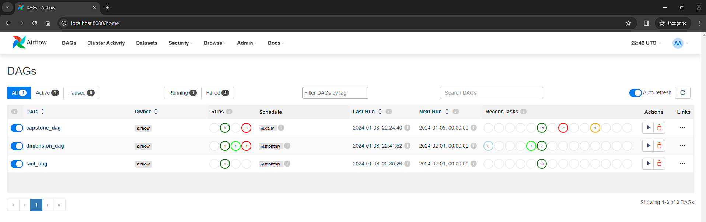
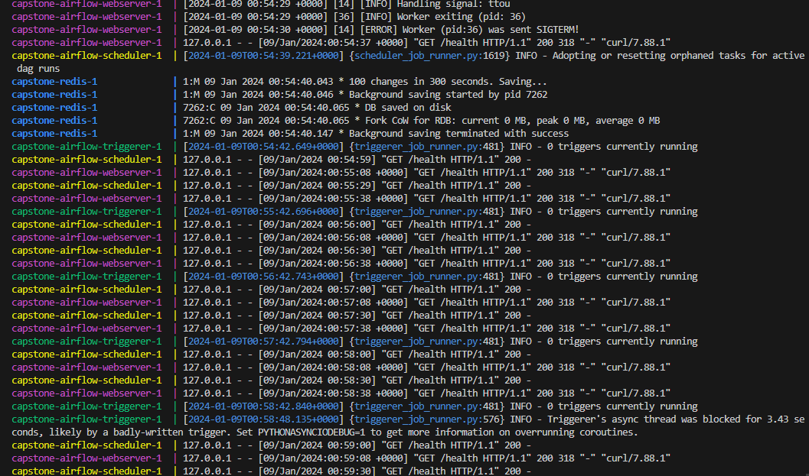
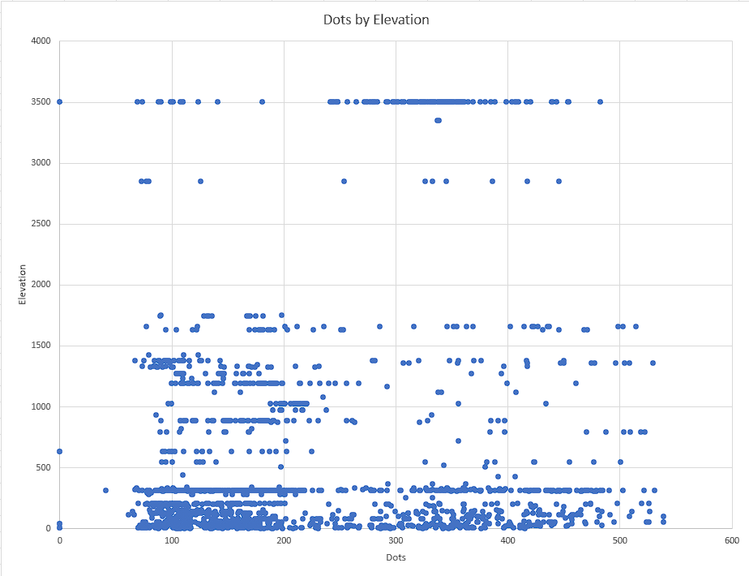
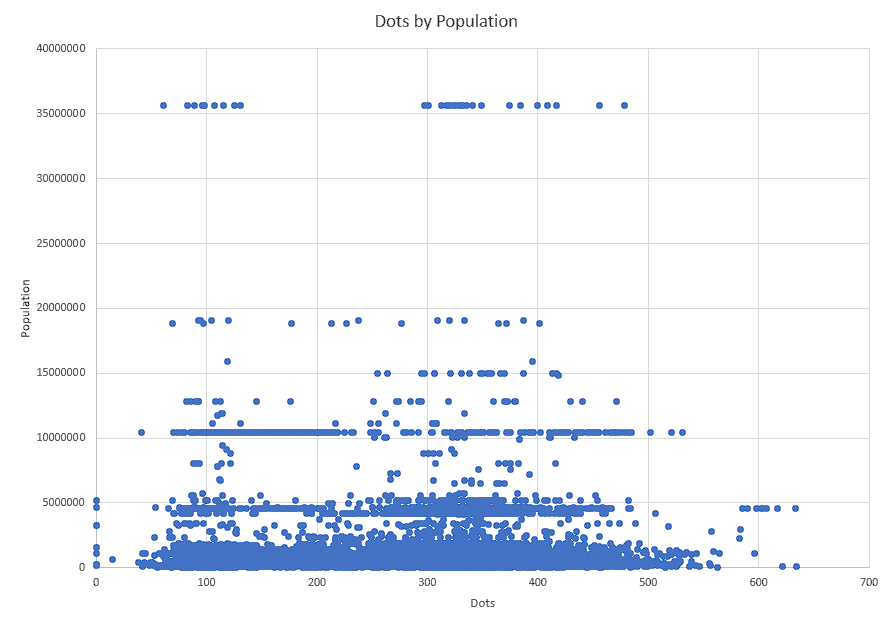

# Udacity Data Engineering Nanodegree Capstone Project

## Submission Information

Author: Timothy Ricks

Submission Date: 2024-01-09

External Repository: [GitHub](https://github.com/rickstc/udacity-data-engineering)

## Project Introduction and Scope

Udacity's Data Engineering Nanodegree Program Capstone Project instructs the student to apply the concepts covered in the course to complete a project provided by Udacity or to independently design their own project. In either case, the student is expected to analyze at least two datasets with at least a million records, define a data model, design and run an ETL data pipeline to load the data into a database, and complete a project write up summarizing the project and answering some questions.

The student opted to design their own project instead of using the resources provided by Udacity. In this capstone project, the student will attempt to identify what (if any) impact elevation and population have on the sport of competitive powerlifting.

## Data Dashboard

The student opted to leverage [Django](https://www.djangoproject.com/) and [Django REST Framework](https://www.django-rest-framework.org/) to build a REST API and visual dashboard to inspect the data in the database. While technically outside the scope of the project; if the goal of the program is to demonstrate the student's ability to engineer a data pipeline to meet the needs of the organization's decision makers, a visual dashboard and API that can be build upon seem like a necessity.

Django is python web framework that provides an ORM (Object Relational Mapper) that makes working with objects in a database easy. Django REST Framework is also a python web framework that provides tools for building REST APIs, as well as a "Browsable API" built using Twitter Bootstrap that allows users to view and search data using HTML.

The student kept the configuration and customization of this dashboard to a minimum and made comments where significant development was made beyond leveraging the frameworks's key components.

Athlete List Example:

This API is paginated by default to improve the performance, and does allow for some filtering and reordering, which would provide decision makers with the ability to sort and filter for data that assists them in making decisions. The student, however, didn't need to leverage this functionality to complete the project.

Athlete Filtering Example:

### A Note on Models

If the project reviewer is familiar with Django, you'll know that it comes bundled with an ORM (Object Relational Mapper). In the sprit of full disclosure, the the student did leverage this to create the database tables for the fact and dimension tables. However, the student designed the models in accordance with the data and selected appropriate data types for the data being stored. Additionally, the create table syntax is documented in the documentation for this project's [Data Models](/docs/data_models.md).

## Data Sources

### Powerlifting Dataset

OpenPowerlifting maintains a data service that aggregates lift data from powerlifting competitions and provides a downloadable CSV file with results from powerlifting meets all over the world. Additionally, OpenPowerlifting maintains good documentation about their data here: [Open Powerlifting Data Documentation](https://openpowerlifting.gitlab.io/opl-csv/bulk-csv-docs.html). As of 1/6/2024, this CSV contains 3,043,014 records, which satisfies the requirements for at least one million records.

### Elevation Dataset

The Global Historical Climatology Network - Daily (GHCN-Daily) maintains a list of weather stations around the world, courtesy of the National Centers for Environment Information, a US agency managed by the National Oceanic and Atmospheric Administration (NOAA). The weather station data contains location and elevation data for 125,968 weather stations globally. Documentation for this data set can be found at the [GHCN-Daily Dataset Overview Page](https://www.ncei.noaa.gov/metadata/geoportal/rest/metadata/item/gov.noaa.ncdc:C00861/html).

### Population/Location Dataset

The powerlifting dataset does not provide coordinate-based location for the powerlifting competitions in it's dataset. In order to determine the elevation and population of the locations that the competitions took place, the student merged the powerlifting data with a third dataset that contains coordinates and population for 4,660 of cities around the world.

This data was obtained from [GitHub User curran](https://gist.github.com/curran/13d30e855d48cdd6f22acdf0afe27286/). If the goal of this project had been the most accurate, complete data, the student would have opted to leverage an API to geocode the contest location data from the powerlifting dataset, and used a more official source of data for population statistics, such as the U.S. Census data for the US. However, the purpose of the project was to demonstrate the ability to model data and build a pipeline for importing it into a database. Therefore, the student decided to leverage this dataset to cut down on potential costs or registration with external APIs, and to make this project more easily reproducible.

## ETL Pipeline

The student leveraged Apache Airflow to build a pipeline that accomplishes:

- Removal of Existing Database Records
- Acquisition of the data from the data sources
- Transformation of the data from the downloaded data into fact tables used to stage the data
- Population of dimension tables from the fact tables that summarizes data for decision makers
- Verification that the records got loaded into the database

Here is an example of the Airflow Dashboard:

The student defined three DAGs (Directed Acyclic Graph) that serve as a blueprint for the data pipeline.

- Fact DAG - This handles the data acquisition and population into fact tables
- Dimension DAG - This handles the transformation of the data stored in the fact tables into the dimension tables
- Capstone DAG - An "all in one" pipeline that fulfills the full scope of the project

The primary reason for defining multiple DAGs was to assist the student during development by not having to run the full pipeline every time.

## Infrastructure

In most modern production environments, these services including Apache Airflow's webserver, scheduler and workers, as well as the database servers, and Django API would be hosted either in an organization's data center or preferably on "the cloud" using a cloud provider such as Amazon Web Services, Microsoft Azure, or Google Cloud Platform.

However, it is common for developers to use a local environment to develop and test their code prior to full deployment. The student opted to leverage Docker to host Apache Airflow and it's services, a PostgreSQL database with the geospatial extensions enabled (commonly referred to as PostGIS), the REST API, and PGAdmin; a database an open-source graphical user interface administration tool for PostgreSQL databases.

This process ran inside a terminal in the student's IDE. Specific notes on the implementation of this is beyond the scope of the project, but comments have been made inside specific student-created files wherever explanation was necessary.

Docker in Terminal Example:

## Project Deliverables

The project deliverables have been organized into the following pages within the "docs/" folder:

### Udacity Required

- [Data Exploration](docs/data_exploration.md) - Covers the data sources and data quality issues
- [Data Models](docs/data_models.md) - Covers the data models and why the student made certain decisions around data storage
- [ETL Pipeline](docs/etl_pipeline.md) - Goes into more detail about the ETL pipeline and the choices the student made during the development of the pipeline
- [Project Write-Up](docs/write_up.md) - Answers the questions posed for the student to consider

### Student Opted to Provide

- [Rubric](docs/rubric.md) - A summary of the project's rubric to be used while grading the project (so that anyone who may come across this in the future can see what was expected of the student)

## Powerlifting Insights

While not part of the project, for anyone curious, the student was not able to determine any correlation between either the elevation where a powerlifting contest took place or the population of the area that the contest took place.

### DOTS

The student based an analysis of "performance" at a powerlifting competition around the competitor's DOTS at a given competition. DOTS stands for Dynamic Optimal Total Score, and it is a mechanism for comparing the strength of a lifter across different weight classes and in different gender's. Generally, the higher an athlete's DOTS, the stronger they are relative to other lifters.

The student aggregated the DOTS entries from the powerlifting data and aggregated them by competition by calculating an "Average" score for a competition.

### Elevation

One might theorize that elevation may play a role in athlete performance. The student plotted the competition's average DOTS against the elevation associated with that competition in the following chart:

There does not appear to be any correlation between the elevation that a contest takes place at and the average DOTS for the competition.

Reasons for this may include:

- Data Quality Issues - The contest's location was determined by string comparing the country and city; this variation may lead to incorrect location determination for a contest. Additionally, elevation was determined by the nearest weather station. The location of the weather station may not correspond directly with the elevation at the meet.
- Regional nature of contests - Athletes at the highest levels can travel great distances to the most prestigious competitions, however, most athlete will compete at competitions that are closest to them. It may be that there is very little variability at most contests because the athletes are already acclimated to the elevation. At the elite level, differences between the elevation that an athlete trains at regularly and the elevation of the competition may have a larger impact on performance, but there is not enough data to perform that analysis.

### Population

One might expect that a competition held in a location with a higher population might result in higher scores, either due to the larger venue attracting better talent or because of access to more training opportunities that come with more resources in an area.

However, just as with elevation, the data does not seem to indicate any correlation between contest's city's population and overall performance.

Reasons for this may include:

- Data Quality Issues - The contest's location was determined by string comparing the country and city; this variation may lead to incorrect location determination for a contest. Additionally, elevation was determined by the nearest weather station. The location of the weather station may not correspond directly with the elevation at the meet.
- General Lack of Correlation - Certain strength sports, like Strongman, may benefit more from additional resources in an area, such as specialized training implements. However, powerlifting focuses on three main lifts: Squat, Bench Press, Deadlift, all of which require only a bar and weights to train for. This equipment should be standard at most commercial facilities and even home/garage gyms.
