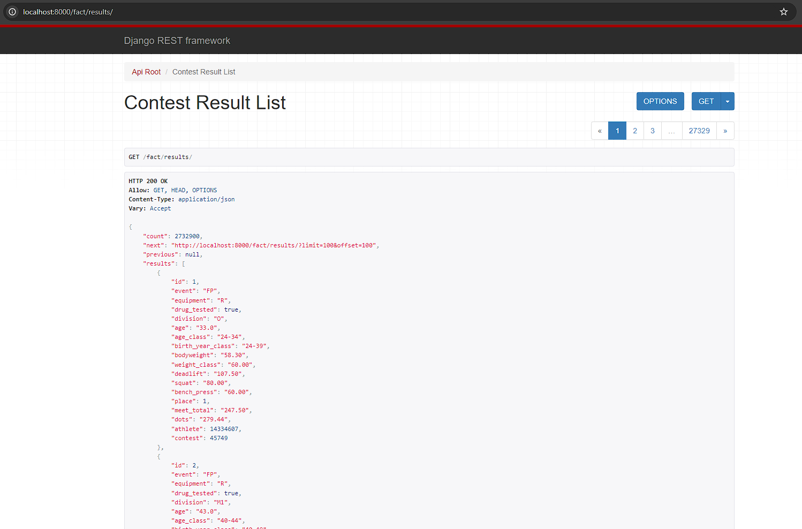

# Data Models

The project instructions broke the project into a series of steps. This document aims to cover the third step:

- [Step 1: Scope the Project and Gather Data](data_exploration.md)
- [Step 2: Explore and Access the Data](data_exploration.md)
- Step 3: Define the Data Model (this document)
- [Step 4: Run ETL to Model the Data](etl_pipeline.md)
- [Step 5: Complete Project Write-Up](write_up.md)

## Udacity Step Definition

These are the instructions given to the student, provided here for context.

### Step 3: Define the Data Model

- Map out the conceptual data model and explain why you chose that model
- List the steps necessary to pipeline the data into the chosen data model

## DBMS Selection

Because location would play a prominent role in the student's goals for analyzing the data, the student needed to select a DBMS that had good geospatial support. The student also determined that the data might fit neatly into a normalized, relational format. Therefore, the student opted to use PostgreSQL with the geospatial extensions enabled.

## Data Model (Fact Tables)

The data was first parsed into fact tables with a goal of normalizing the data for storage and retrieval. The student wanted the data to be stored in normalized tables appropriate for long-term storage and retrieval, with a goal of reusability and data completeness.

An advantage of storing the data in these fact tables is that the cleaned, normalized data could be exposed to data users and stakeholders via the API or dashboard.

Example Contest Results:


### Powerlifting Data

The flat structure of the powerlifting data was convenient to parse, but far from a normalized data structure. The student chose to split this data into four separate tables:

- Athlete
- Contest
- Contest Location
- Contest Result

#### Athlete Table

Information about an athlete who participated in a powerlifting contest.

| Field | Description |
| --- | --- |
| id | a primary key for the table |
| name | the athlete's name |
| deduplication_number | the OPL data set deduplicates athletes with the same name using a pound sign and a number |
| gender | a one character identifier for gender (M, F, X) |

```sql
-- Create Table Syntax
CREATE TABLE IF NOT EXISTS public.fact_athlete
(
    id bigint NOT NULL GENERATED BY DEFAULT AS IDENTITY ( INCREMENT 1 START 1 MINVALUE 1 MAXVALUE 9223372036854775807 CACHE 1 ),
    name character varying(128) COLLATE pg_catalog."default" NOT NULL,
    deduplication_number smallint NOT NULL,
    gender character varying(1) COLLATE pg_catalog."default" NOT NULL,
    CONSTRAINT fact_athlete_pkey PRIMARY KEY (id),
    CONSTRAINT fact_athlete_name_deduplication_number_f1a9740b_uniq UNIQUE (name, deduplication_number),
    CONSTRAINT fact_athlete_deduplication_number_check CHECK (deduplication_number >= 0)
)
```

#### Contest Location

Information about a powerlifting contest's location

| Field | Description |
| --- | --- |
| id | a primary key for the table |
| country | country the meet took place in |
| state | the state the meet took place in (if given) |
| town | the town the meet too place in (if given) |
| location | a point field representing the contests's coordinates (from the secondary location data set) (optional) |
| population | the population of the town the meet took place in (from the secondary location data set) (optional) |

```sql
-- Create Table Syntax
CREATE TABLE IF NOT EXISTS public.fact_contestlocation
(
    id bigint NOT NULL GENERATED BY DEFAULT AS IDENTITY ( INCREMENT 1 START 1 MINVALUE 1 MAXVALUE 9223372036854775807 CACHE 1 ),
    country character varying(128) COLLATE pg_catalog."default" NOT NULL,
    state character varying(128) COLLATE pg_catalog."default" NOT NULL,
    town character varying(128) COLLATE pg_catalog."default" NOT NULL,
    location geometry(Point,4326),
    population integer NOT NULL,
    CONSTRAINT fact_contestlocation_pkey PRIMARY KEY (id),
    CONSTRAINT fact_contestlocation_country_state_town_580eb48b_uniq UNIQUE (country, state, town),
    CONSTRAINT fact_contestlocation_population_check CHECK (population >= 0)
)
```

#### Contest Table

Information about a powerlifting contest in general.

| Field | Description |
| --- | --- |
| id | a primary key for the table |
| name | the name of the contest |
| federation | the federation hosting the powerlifting meet (competition) |
| parent_federation | the topmost federation that sanctioned the meet |
| date | the competition date |
| location_id | the foreign key of the location table |

```sql
-- Create Table Syntax
CREATE TABLE IF NOT EXISTS public.fact_contest
(
    id bigint NOT NULL GENERATED BY DEFAULT AS IDENTITY ( INCREMENT 1 START 1 MINVALUE 1 MAXVALUE 9223372036854775807 CACHE 1 ),
    name character varying(256) COLLATE pg_catalog."default" NOT NULL,
    federation character varying(64) COLLATE pg_catalog."default" NOT NULL,
    parent_federation character varying(64) COLLATE pg_catalog."default" NOT NULL,
    date date NOT NULL,
    location_id bigint NOT NULL,
    CONSTRAINT fact_contest_pkey PRIMARY KEY (id),
    CONSTRAINT fact_contest_location_id_dc742456_fk_fact_contestlocation_id FOREIGN KEY (location_id)
        REFERENCES public.fact_contestlocation (id) MATCH SIMPLE
        ON UPDATE NO ACTION
        ON DELETE NO ACTION
        DEFERRABLE INITIALLY DEFERRED
)
```

#### Contest Result

Information about a contest result. These entries represent information about an athlete's performance at a given contest.

| Field | Description |
| --- | --- |
| id | a primary key for the table |
| athlete_id | the foreign key of the athlete |
| contest_id | the foreign key of the contest for these results |
| event | a two character representation of the event the athlete competed in (FP, BD, SD, etc.) |
| equipment | a single character representation of the equipment category under which the event was performed (R, W, S, etc.) |
| drug_tested | boolean for whether the lifter was competing in a drug tested category |
| division | optional description of the division the lifter competed in |
| age | optional integer for the age of the athlete at the time of the meet |
| age_class | optional description of the age class the athlete competed in |
| birth_year_class | optional description of the birth year class the athlete competed in |
| bodyweight | decimal field representing the bodyweight of the lifter at the time of the competition, in kg |
| weight_class | decimal field representing the weight class the lifter competed in |
| deadlift | decimal field the lifter's best deadlift of the competition |
| squat | decimal field the lifter's best squat of the competition |
| bench_press | decimal field the lifter's best bench press of the competition |
| place | integer representing the athlete's place in the competition |
| meet_total | the sum of the athlete's best completed attempts |
| dots | decimal field with the athlete's dots score |

```sql
-- Create Table Syntax
CREATE TABLE IF NOT EXISTS public.fact_contestresult
(
    id bigint NOT NULL GENERATED BY DEFAULT AS IDENTITY ( INCREMENT 1 START 1 MINVALUE 1 MAXVALUE 9223372036854775807 CACHE 1 ),
    event character varying(2) COLLATE pg_catalog."default" NOT NULL,
    equipment character varying(1) COLLATE pg_catalog."default" NOT NULL,
    drug_tested boolean NOT NULL,
    division character varying(64) COLLATE pg_catalog."default" NOT NULL,
    age numeric(4,1) NOT NULL,
    age_class character varying(6) COLLATE pg_catalog."default" NOT NULL,
    birth_year_class character varying(6) COLLATE pg_catalog."default" NOT NULL,
    bodyweight numeric(5,2) NOT NULL,
    weight_class numeric(5,2) NOT NULL,
    deadlift numeric(5,2) NOT NULL,
    squat numeric(5,2) NOT NULL,
    bench_press numeric(5,2) NOT NULL,
    place smallint NOT NULL,
    meet_total numeric(6,2) NOT NULL,
    dots numeric(5,2) NOT NULL,
    athlete_id bigint NOT NULL,
    contest_id bigint NOT NULL,
    CONSTRAINT fact_contestresult_pkey PRIMARY KEY (id),
    CONSTRAINT fact_contestresult_athlete_id_7aef5631_fk_fact_athlete_id FOREIGN KEY (athlete_id)
        REFERENCES public.fact_athlete (id) MATCH SIMPLE
        ON UPDATE NO ACTION
        ON DELETE NO ACTION
        DEFERRABLE INITIALLY DEFERRED,
    CONSTRAINT fact_contestresult_contest_id_4a72a25d_fk_fact_contest_id FOREIGN KEY (contest_id)
        REFERENCES public.fact_contest (id) MATCH SIMPLE
        ON UPDATE NO ACTION
        ON DELETE NO ACTION
        DEFERRABLE INITIALLY DEFERRED,
    CONSTRAINT fact_contestresult_place_check CHECK (place >= 0)
)
```

### Weather Stations

Information about the weather stations.

| Field | Description |
| --- | --- |
| id | a primary key for the table |
| station_id | NOAA's station identifier |
| elevation | decimal field storing the elevation of the weather station |
| station_state | an optional two digit character field representing the state of the weather station |
| station_name | an optional name for the weather station |
| gsn_flag | a boolean indicating whether the weather station is part of the GCOS Surface Network |
| wmo_id | the station's WMO identifier |
| station_location | a point field representing the geographic coordinates of the weather station |

```sql
-- Create Table Syntax
CREATE TABLE IF NOT EXISTS public.fact_weatherstation
(
    id bigint NOT NULL GENERATED BY DEFAULT AS IDENTITY ( INCREMENT 1 START 1 MINVALUE 1 MAXVALUE 9223372036854775807 CACHE 1 ),
    station_id character varying(11) COLLATE pg_catalog."default" NOT NULL,
    elevation numeric(6,1) NOT NULL,
    station_state character varying(2) COLLATE pg_catalog."default" NOT NULL,
    station_name character varying(30) COLLATE pg_catalog."default" NOT NULL,
    gsn_flag boolean NOT NULL,
    wmo_id integer NOT NULL,
    station_location geometry(Point,4326) NOT NULL,
    CONSTRAINT fact_weatherstation_pkey PRIMARY KEY (id),
    CONSTRAINT fact_weatherstation_station_id_key UNIQUE (station_id),
    CONSTRAINT fact_weatherstation_wmo_id_check CHECK (wmo_id >= 0)
)
```

## Data Model (Dimension Tables)

Once the data had been placed into normalized tables, the student needed to consider how the data might need to be formatted to accomplish the project's goals:

1. Determining what impact elevation has on athlete performance
2. Determining what impact population has on athlete performance

Both goals involve analyzing how athlete performance is impacted by factors related to the contest location: either the elevation of the event or the population close to the event.

Therefore, the "performance" of an athlete, measured by DOTS score, would need to be aggregated and associated to a contest, for which the location and other geographic factors would need to be determined.

This aggregation is possible based on the fact tables, but would be cumbersome to load on a regular basis. While fact tables contain the core quantitative data points, organizations may create additional analytics tables (derived from fact tables) to provide specific information to decision-makers in a performant and readily digestible format. These analytics tables might involve aggregations and some denormalization to optimize queries and present information tailored to specific analysis needs.

The student defined two dimension tables:

- Contest
- Contest Location

### Contest

This table builds on the information stored in the corresponding fact table, but also contains a summary of contest results.

| Field | Description |
| --- | --- |
| id | a primary key for the table |
| fact_contest_id | a reference (not a foreign key) to the corresponding fact table's contest |
| date | the date of the contest |
| federation | the federation hosting the powerlifting meet |
| location_id | a foreign key to the location dimension table  |
| average_dots | decimal field containing the average dots scores of all athletes at the competition |
| standard_deviation | the standard deviation of these dots scores |

```sql
-- Create Table Syntax
CREATE TABLE IF NOT EXISTS public.dimension_contest
(
    id bigint NOT NULL GENERATED BY DEFAULT AS IDENTITY ( INCREMENT 1 START 1 MINVALUE 1 MAXVALUE 9223372036854775807 CACHE 1 ),
    fact_contest_id bigint NOT NULL,
    date date NOT NULL,
    name character varying(256) COLLATE pg_catalog."default" NOT NULL,
    federation character varying(128) COLLATE pg_catalog."default" NOT NULL,
    average_dots numeric(5,2) NOT NULL,
    standard_deviation numeric(5,2) NOT NULL,
    location_id bigint NOT NULL,
    CONSTRAINT dimension_contest_pkey PRIMARY KEY (id),
    CONSTRAINT dimension_contest_fact_contest_id_key UNIQUE (fact_contest_id),
    CONSTRAINT dimension_contest_location_id_e42023d9_fk_dimension_location_id FOREIGN KEY (location_id)
        REFERENCES public.dimension_location (id) MATCH SIMPLE
        ON UPDATE NO ACTION
        ON DELETE NO ACTION
        DEFERRABLE INITIALLY DEFERRED
)
```

### Location

This table builds on the information stored in the corresponding contest location data by pulling in weather station data from the closest weather station, as determined by comparing the coordinate fields on each table.

| Field | Description |
| --- | --- |
| id | a primary key for the table |
| fact_location_id | a reference (not a foreign key) to the corresponding fact table's location |
| country | country the meet took place in |
| state | the state the meet took place in (if given) |
| town | the town the meet too place in (if given) |
| loc_coords | geographic coordinates of the contest location  |
| weather_station | the station name of the geographically nearest weather station |
| distance_to_station | a decimal field indicating the distance to the weather station in km |
| elevation | decimal field storing the elevation of the weather station |
| population | the population of the town the meet took place in |

```sql
-- Create Table Syntax
CREATE TABLE IF NOT EXISTS public.dimension_location
(
    id bigint NOT NULL GENERATED BY DEFAULT AS IDENTITY ( INCREMENT 1 START 1 MINVALUE 1 MAXVALUE 9223372036854775807 CACHE 1 ),
    fact_location_id bigint NOT NULL,
    country character varying(128) COLLATE pg_catalog."default" NOT NULL,
    state character varying(128) COLLATE pg_catalog."default" NOT NULL,
    town character varying(128) COLLATE pg_catalog."default" NOT NULL,
    loc_coords geometry(Point,4326) NOT NULL,
    weather_station character varying(30) COLLATE pg_catalog."default" NOT NULL,
    station_coords geometry(Point,4326) NOT NULL,
    distance_to_station numeric(6,1),
    elevation numeric(6,1),
    population integer NOT NULL,
    CONSTRAINT dimension_location_pkey PRIMARY KEY (id),
    CONSTRAINT dimension_location_fact_location_id_key UNIQUE (fact_location_id),
    CONSTRAINT dimension_location_population_check CHECK (population >= 0)
)
```

## Pipeline Steps

The steps necessary to pipeline the data into the chosen models would be:

- Acquire the data from the different data sources
- Use a python script to read data from the data sources and manipulate it to fit the chosen schema
- Insert the data into the fact tables
- Leverage SQL queries to populate the dimension tables from the fact tables
- Run data quality checks as needed
