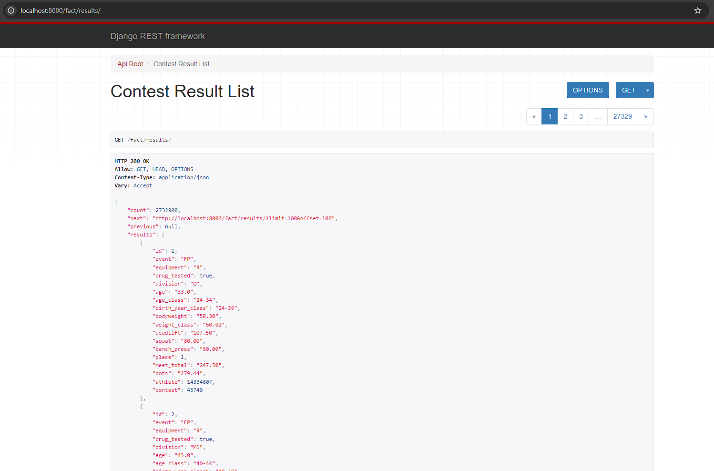

# ETL Pipeline

The project instructions broke the project into a series of steps. This document aims to cover the third step:

- [Step 1: Scope the Project and Gather Data](data_exploration.md)
- [Step 2: Explore and Access the Data](data_exploration.md)
- [Step 3: Define the Data Model](data_models.md)
- Step 4: Run ETL to Model the Data (this document)
- [Step 5: Complete Project Write-Up](write_up.md)

## Udacity Step Definition

These are the instructions given to the student, provided here for context.

### Step 4: Run ETL to Model the Data

- Create the data pipelines and the data model
- Include a data dictionary
- Run data quality checks to ensure the pipeline ran as expected
  - Integrity constraints on the relational database (e.g., unique key, data type, etc.)
  - Unit tests for the scripts to ensure they are doing the right thing
  - Source/count checks to ensure completeness

## Pipeline

The student opted to use Apache Airflow to construct the ETL pipeline because that was the specific technology covered in the course, though there are other similar alternatives that exist such as [Prefect](https://www.prefect.io/opensource) and [Luigi](https://github.com/spotify/luigi).

Apache Airflow represents data pipelines as a series of tasks in a DAG (Directed Acyclic Graph). To accomplish the data pipeline, the student created a single DAG that would handle the data acquisition, manipulation, fact table population, and dimension table population.

However, to speed up development the student opted to split this unified DAG into two separate DAGs:

- Fact DAG - for data acquisition and fact table population
- Dimension DAG - for populating the dimension tables from the fact tables

### Capstone DAG

The capstone dag incorporates all pipeline logic required by the application. The following illustration shows the airflow dashboard opened to the Capstone DAG demonstrating a successful run.

### Fact DAG

The fact dag incorporates all pipeline logic required to acquire the data and populate the fact tables. The following illustration shows the airflow dashboard opened to the Fact DAG demonstrating a successful run.

### Dimension DAG

The dimension dag incorporates all pipeline logic required to populate the dimension tables from the fact dag. The following illustration shows the airflow dashboard opened to the Dimension DAG demonstrating a successful run.

## Data Quality

Different checks were run at different times to ensure data quality. Checks were run to ensure the data was downloaded correctly and that data was inserted correctly.

Additionally, as discussed in the [Data Models](data_models.md) section, strict database constraints were placed on the table definitions, as this is the best way to prevent bad data from being inserted into the database.

## Data Table Population

Each of the tables was populated by the pipeline and made accessible to potential end users through the REST API and corresponding Browsable UI.

### Fact - Athlete

### Fact - Contest

### Fact - Location

### Fact - Result

### Fact - Station

### Dimension - Location

### Dimension - Contest

