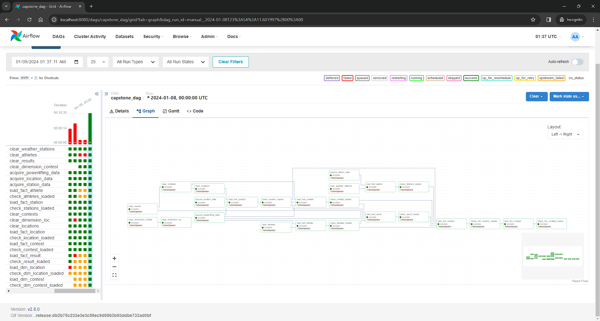

# Project Write Up

The project instructions broke the project into a series of steps. This document aims to cover the third step:

- [Step 1: Scope the Project and Gather Data](data_exploration.md)
- [Step 2: Explore and Access the Data](data_exploration.md)
- [Step 3: Define the Data Model](data_models.md)
- [Step 4: Run ETL to Model the Data](etl_pipeline.md)
- Step 5: Complete Project Write-Up (this document)

## Udacity Step Definition

These are the instructions given to the student, provided here for context.

### Step 5: Complete Project Write Up

- What's the goal? What queries will you want to run? How would Spark or Airflow be incorporated? Why did you choose the model you chose?
- Clearly state the rationale for the choice of tools and technologies for the project.
- Document the steps of the process.
- Propose how often the data should be updated and why.
- Post your write-up and final data model in a GitHub repo.
- Include a description of how you would approach the problem differently under the following scenarios:
  - If the data was increased by 100x.
  - If the pipelines were run on a daily basis by 7am.
  - If the database needed to be accessed by 100+ people.

## Goal

The goal of the project is to determine what impact (if any) the powerlifting competition's elevation or population might have on athlete performance.

To accomplish this, contest results were aggregated into dimension tables representing a contest with it's average results and the contest's location with it's population and elevation data.

The student opted to build a dashboard to expose all necessary data to end users without having to run individual queries. If the goal is to make data available to end users, it is usually unrealistic to expect most of the users to need to write and execute queries manually.

Here is example of the report data coming back using postman:

CSV Format


JSON Format


However, that same data can be obtained using the following SQL Query:

```sql
SELECT
    date,
    name,
    average_dots,
    standard_deviation,
    country,
    state,
    town,
    weather_station,
    distance_to_station,
    elevation,
    population 
FROM dimension_contest dc
JOIN dimension_location dl
ON dc.location_id = dl.id;
```

Here are the results of that query being run visually:


Airflow was leveraged to build a data pipeline that could be monitored visually.



## Technologies and Tools

The following technologies and tools were chosen for this project:

- Docker - [Docker](https://www.docker.com/) was leveraged to provide the student with a containerized copy of all other applications. This allowed the student to test and run the pipeline locally without having to incur costs associated with cloud hosting. Additionally, because the student did not install packages directly on the operating system, cleanup was easy and dependency issues with other packages from other projects were avoided.
- Apache Airflow - [Apache Airflow](https://airflow.apache.org/) was chosen to build the ETL Pipeline primarily because it was the focus of one of the modules in the course. Other alternatives could include [Prefect](https://www.prefect.io/opensource), [Luigi](https://github.com/spotify/luigi) or [AWS Step Functions](https://aws.amazon.com/step-functions/).
- Django with Django Rest Framework - [Django](https://www.djangoproject.com/) and [Django Rest Framework](https://www.django-rest-framework.org/) make it easy to set up a REST API. There are many alternatives, written in a variety of languages. However, Django is slightly opinionated and feature rich, including ORM and local development server out of the box. It can be modified to deploy and serve production applications. It was chosen primarily because of the student's familiarity with the framework, quick set up, and ease of use.
- PostGIS - [PostGIS](https://postgis.net/) extends the capabilities of Postgres to add "support for storing, indexing, and querying geospatial data". It also conveniently integrates with Django's ORM. PostGIS provides a scalable, performant, and capable Relational Database Management System with support for JSON Fields in the event that document storage is required (rivaling MongoDB), and geospatial support. Many cloud providers also offer managed versions of Postgres and PostGIS, making it a good choice for production workloads.

## Steps

The following steps are taken by the ETL Pipeline:

- Removal of Existing Database Records
- Acquisition of the data from the data sources
- Transformation of the data from the downloaded data into fact tables used to stage the data
- Population of dimension tables from the fact tables that summarizes data for decision makers
- Verification that the records got loaded into the database

## Data Updates

The goals of the project and the nature of the data do not make it imperative to always have the most updated data. Only a handful of powerlifting competitions take place each week, and as such it is unknown to the student how often the OpenPowerlifting Data Service is updated, though it appears that edits to the data are made by community members on a regular basis:


Generally, the student would recommend updating the data as often as stakeholders believe it needs to be updated, within a schedule that makes sense given how quickly the underlying data sources are updated. In the context of this project, a monthly update seems appropriate.

## Write Up and Final Model

The student is instructed to post the Write-Up and Final model in a GitHub Repository. That is this [repository](https://github.com/rickstc/udacity-data-engineering).

## Scenarios

How would the student approach the problem differently under the following scenarios:

1. If the data was increased by 100x.

    If the data was increased 100x, the data inserts would almost certainly need to take place in batches. Currently, the OPL data set is the largest data set consumed by this project, with just over 3 million entries. That zip file is 120 MB on disk. If the data was increased by 100x, the downloading of that file would likely need to be offloaded to a cloud server with an attached EFS (Elastic File System - AWS).

    The student would recommend splitting the CSV into multiple files, perhaps coinciding with a single year and quarter's worth of powerlifting meets.

    Alternatively, it is likely that if the data volume grew by that much, the maintainers of the Open Powerlifting DataSet might develop series of files split in logical ways, perhaps by year, to enable incremental data updates. Because they are an open source project, if the data were to increase by that much and this was a mission critical application, it might be worth getting involved with them to see if they have any data segmentation in place already or perhaps assist in developing that in coordination with them.

    It is very important to the Open Source ecosystem to give back whenever possible, especially if the services provided by the Open Source Community enable an organization to meet their goals and objectives.

2. If the pipelines were run on a daily basis by 7am.

    If the pipelines were to be run on a daily basis at 7:00 AM, the student wouldn't make any adjustments. This pipeline could easily be run daily without impacting users.

3. If the database needed to be accessed by 100+ people.

    The student would highly recommend leveraging read replicas in any scenario, but especially as the number of concurrent users increased. One caveat to that answer depends slightly on how the database is to be accessed. Are these users accessing the data in the database through the API that was developed? In that case, generally applications leverage connection pooling and caching. The impact of 100+ users should be pretty easy for a single instance to handle, especially because the schema was designed to minimize costly joins with the implementation of the dimension tables.

    Hosting the database in the could is also highly recommended, as most cloud providers offer the ability to scale the servers horizonally (adding more servers), as well as vertically (increasing the underlying compute resources of the server).
